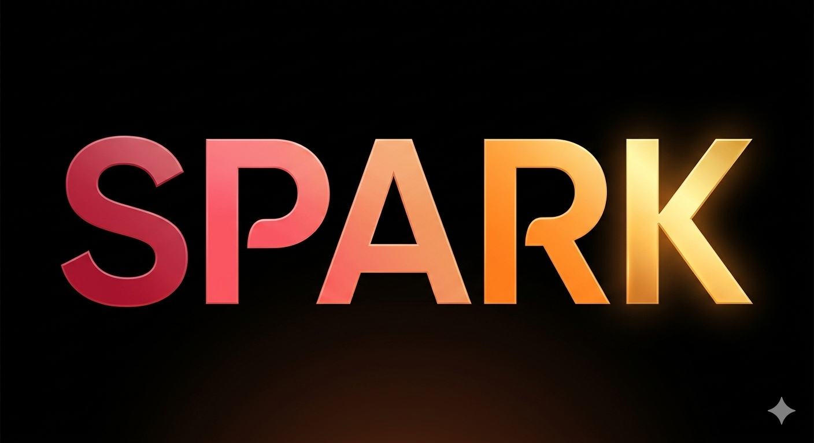

<div align="center">



# Spark

**Application Web de Rencontre**

**(16/03 - 10/04)**

[](https://github.com/mrwn111/app-dating)
[](https://github.com/mrwn111/app-dating)
[](https://github.com/mrwn111/app-dating)
[](https://github.com/mrwn111/app-dating)

</div>

<br />

## ℹ️ À propos 

Spark est une application de rencontre développée dans le cadre d'un projet de DevSecOps. L'objectif principal est de proposer une solution de rencontre simple, OpenSource et sécurisée.

Notre approche met l'accent sur la protection des données et la robustesse du code pour garantir une expérience de confiance aux utilisateurs.

## 🛠️ Patchnote 


### 🖥️ Frontend

- **Mauvais profil affiché dans l'animation de swipe** : le toast "tu as liké..." affichait le profil derrière la carte visible et non celui du dessus.
  **Fix** : capture locale de `topCardProfile` au moment exact du swipe dans `flyOut()`.

- **Ordre des cartes inversé dans le stack** : la carte du dessus n'était pas correctement identifiée par le CSS.
  **Fix** : `renderDeck()` insère désormais `deck[2]` en premier et `deck[0]` en dernier (`last-child`) pour donner le bon `z-index` à la carte active.

- **Drag attaché à la mauvaise carte** : le handler `onDragStart` ne re-sélectionnait pas le bon élément au moment du drag.
  **Fix** : re-sélection explicite du `last-child` dans `onDragStart`.

---

### ⚙️ Backend

- **Match non affiché mutuellement** : quand l'utilisateur A likait B, le match n'apparaissait pas dans la fenêtre "Matches" du compte de B.
  **Fix** : correction de la route `/api/matches/like` pour créer l'entrée match dans les deux sens en base de données.

---

### 🔧 Pipeline CI/CD

- **TruffleHog - BASE et HEAD identiques** : TruffleHog échouait sur les push directs sur `main`.
  **Fix** : remplacement de `base: default_branch` par `base: ${{ github.event.before }}`.

- **Trivy - Faux positif JWT dans `fake_secret_demo.py`** : Trivy détectait le JWT de démonstration et faisait échouer le scan pré-build.
  **Fix** : ajout de `fake_secret_demo.py` dans `.trivyignore`.

- **Bandit - Alerte B104 (Hardcoded bind  to all interfaces)** : Bandit bloquait la pipeline car Flask doit écouter sur 0.0.0.0 pour que le mapping de port avec l'hôte fonctionne.
  **Fix** : Ajout du flag `-s B104` dans la commande Bandit de la pipeline pour ignorer cette alerte spécifique au contexte de conteneurisation.

## 📦 Guide d'installation

L'application est disponible sur Docker Hub sous le nom `nblsc/mon-app`.

***Note sur le port** : Par défaut, l'application tourne sur le port 5000 à l'intérieur du conteneur. Si ce port est déjà utilisé sur votre machine, utilisez un autre port disponible comme le 8080 par exemple.*

**Méthode 1 :** Terminal (Ligne de Commande)

Exécutez cette commande pour lancer l'application instantanément :
```
docker run -d -p 8080:5000 --name spark-app nblsc/mon-app:latest
```
L'application sera alors accessible à l'adresse suivante : `http://localhost:8080` ( remplacez 8080 par le port que vous avez décidé d'utiliser)

**Méthode 2 :** Docker Desktop (Interface Graphique)

Dans la barre de recherche en haut, tapez `nblsc/mon-app` et cliquez sur Pull.

Allez dans l'onglet Images et cliquez sur Run sur l'image `nblsc/mon-app`.

Ouvrez le menu Optional settings : 
- Host Port : Entrez le port de votre choix (ex: 8080).
- Container Name : Donnez un nom (ex: spark-app).

Cliquez sur Run.
L'application sera alors accessible à l'adresse suivante : `http://localhost:8080` ( remplacez 8080 par le port que vous avez décidé d'utiliser)
